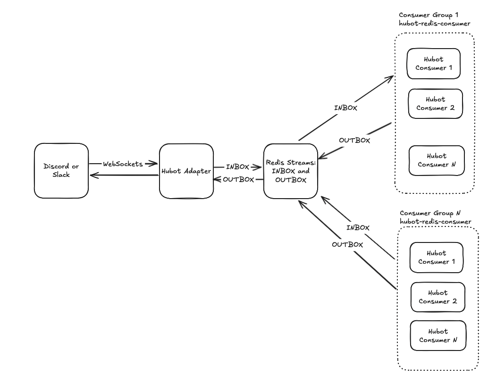

# hubot-redis-inbox

`hubot-redis-inbox` is a Hubot script that enables horizontal scaling of Hubot by using Redis Streams and Consumer Groups. It adds all incoming messages to a Redis stream (INBOX) and reads from another stream (OUTBOX) to deliver messages to the chat adapter. This allows multiple Hubot instances (Redis Consumers) to coordinate and process messages efficiently. The Redis Consumer Groups facility load balances the messages across the Hubot consumers/instances.

## Features

- Adds all chat messages to a Redis stream (INBOX)
- Reads messages from a Redis stream (OUTBOX) and delivers them to the chat adapter
- Uses Redis Streams and Consumer Groups for horizontal scaling
- Supports custom stream, group, and consumer names via environment variables

## Installation

1. Install dependencies:
	 ```sh
	 npm install
	 ```
2. Add `hubot-redis-inbox` to your Hubot scripts or external scripts (`external-scripts.json`) configuration.

## Configuration

Set the following environment variables as needed:

- `HUBOT_REDIS_INBOX_URL` (default: `redis://localhost:6378`)
- `HUBOT_REDIS_INBOX_STREAM_NAME` (default: `hubot-inbox`)
- `HUBOT_REDIS_OUTBOX_STREAM_NAME` (default: `hubot-outbox`)
- `HUBOT_REDIS_OUTBOX_GROUP_NAME` (default: `hubot-group`)
- `HUBOT_REDIS_OUTBOX_CONSUMER_NAME` (default: `consumer1`)

## Usage

Start Hubot as usual with your preferred adapter (`@hubot-friends/hubot-discord`, `@hubot-friends/hubot-slack`). Include this (`@hubot-friends/hubot-redis-inbox`) in your `external-scripts.json` file like so:

```json
[
    "@hubot-friends/hubot-redis-inbox"
]
```

All incoming messages will be added to the INBOX stream and processed from the OUTBOX stream.

Start up multiple Hubot instances that contain the scripts with all the command handling functionality. Make sure each instance has a different consumer name.

Start them with the `@hubot-friends/hubot-redis-consumer` adapter.

```sh
hubot -f ./index.mjs -a @hubot-friends/hubot-redis-consumer -n the-bot-name-used-with-the-chat-hubot
```



## Development & Testing

Run tests with:

```sh
npm test
```

## License

MIT